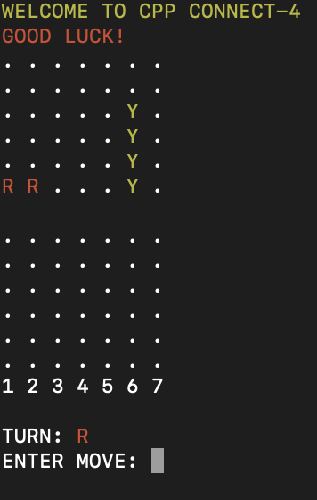
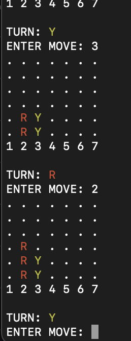
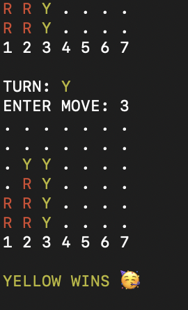
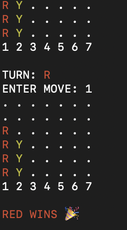

# 🔴🟡 CPP-ConnectFour
This is a C++ Implementation of the game Connect 4.
<div align="center">
  
  <br><br>
</div>

# 👋 Intro
[**Connect Four**](https://en.wikipedia.org/wiki/Connect_Four)  is a game in which the players choose a color and then take turns dropping colored tokens into a six-row, seven-column vertically suspended grid. The pieces fall straight down, occupying the lowest available space within the column. The objective of the game is to be the first to form a horizontal, vertical, or diagonal line of four of one's own tokens. It is therefore a type of [**m,n,k-game**](https://en.wikipedia.org/wiki/M,n,k-game) (7, 6, 4) with restricted piece placement. Connect Four is a [**solved game**](https://en.wikipedia.org/wiki/Solved_game); the first player can always win by playing the right moves.

The game was created by Howard Wexler, and first sold under the Connect Four trademark by [**Milton Bradley**](https://en.wikipedia.org/wiki/Milton_Bradley_Company) in February 1974.

# 🛠️ Setup & Build
This project uses [**CMake**](https://cmake.org/) as a build tool and [**Catch2**](https://github.com/catchorg/Catch2) as a testing framework.

In order to build the project:
```
cmake -B build
cmake --build build
```
In order to run test cases:
```
./build/unit_tests
```
In order to run the application/play the game:
```
./build/connect4
```

# 🍴 Forking & Contribution
Users are more than welcome to both fork this repo and use the code here. This can be to make a contribution to this codebase or for a users own external purposes.

However please do take note of the following:
[**LICENSE**](./LICENSE)

☕☕☕**CHEERS AND THANK YOU**☕☕☕

# 🌉 Gallery
<div align="center" style="display: flex; justify-content: center; gap: 16px; flex-wrap: wrap;">
  
  
  
  
</div>
